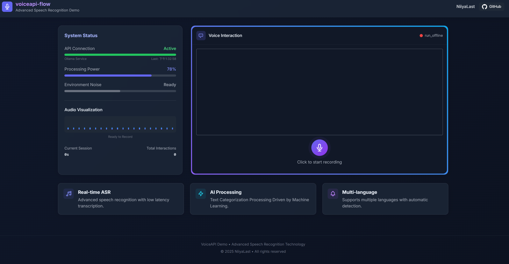

# 🎤 VoiceAPI-Flow

<div align="center">

[](https://python.org)
[](https://fastapi.tiangolo.com)
[](LICENSE)
[](https://github.com/k2-fsa/sherpa-onnx)

**基于 VoiceAPI 的智能语音工作流解决方案**

*一个专为实际业务场景设计的语音转录与数据处理工具*

</div>

---

## 📋 目录

- [项目简介](#-项目简介)
- [核心功能](#-核心功能) 
- [与原项目对比](#-与原项目对比)
- [系统架构](#-系统架构)
- [快速开始](#-快速开始)
- [配置说明](#-配置说明)
- [使用指南](#-使用指南)
- [API文档](#-api文档)
- [贡献](#-贡献)
- [致谢](#-致谢)

---

## 🎯 项目简介

**VoiceAPI-Flow** 是基于 [ruzhila/voiceapi](https://github.com/ruzhila/voiceapi) 开发的智能语音工作流解决方案。本项目专注于语音识别(ASR)功能，去除了原项目的语音合成(TTS)功能，在高精度语音转录基础上构建了完整的数据处理管道，特别适用于需要语音数据结构化分析的业务场景。

### 🎨 界面展示

<div align="center">


</div>

---

## ✨ 核心功能

### 🎙️ 语音处理
- **实时语音转录**：基于 Sherpa-ONNX 的高精度中英文识别
- **多模型支持**：支持 FireRed ASR、SenseVoice、Paraformer 等多种 ASR 模型
- **噪声抑制**：内置环境噪声检测与过滤
- **音频可视化**：实时波形显示和录音状态监控

### 📊 数据智能分析
- **AI 文本处理**：自动纠错、关键信息提取
- **结构化输出**：语音内容自动转换为 Excel 格式
- **任务配置**：支持不同业务场景的自定义处理规则
- **批量处理**：高效处理大量语音数据

### 🔧 系统管控
- **配置热重载**：无需重启即可更新配置
- **日志管理**：完整的操作日志和错误追踪
- **状态监控**：系统运行状态实时监控
- **自动备份**：数据安全保障机制

---

## 🆚 与原项目对比

<table>
<tr>
<th width="20%">功能模块</th>
<th width="40%">🔸 原项目 (ruzhila/voiceapi)</th>
<th width="40%">🔹 本项目 (VoiceAPI-Flow)</th>
</tr>

<tr>
<td><strong>🎯 定位</strong></td>
<td>通用语音API服务<br/>适合开发者集成</td>
<td>端到端工作流解决方案<br/>适合业务直接使用</td>
</tr>

<tr>
<td><strong>🎙️ 语音识别</strong></td>
<td>✅ WebSocket流式识别<br/>✅ 多语言模型支持<br/>✅ 高精度转录</td>
<td>✅ 继承所有原功能<br/>🆕 噪声检测与过滤<br/>🆕 录音状态智能管理<br/>🆕 音频可视化界面</td>
</tr>

<tr>
<td><strong>🔊 语音合成</strong></td>
<td>✅ 多种TTS模型<br/>✅ 流式音频输出<br/>✅ 说话人选择</td>
<td>❌ 已移除TTS功能<br/>� 专注于ASR语音识别<br/>⚡ 减少系统复杂度</td>
</tr>

<tr>
<td><strong>📄 数据处理</strong></td>
<td>❌ 仅提供原始文本</td>
<td>🆕 AI智能文本处理<br/>🆕 自动纠错与格式化<br/>🆕 关键信息结构化提取<br/>🆕 Excel自动生成</td>
</tr>

<tr>
<td><strong>⚙️ 配置管理</strong></td>
<td>✅ 基础配置文件</td>
<td>✅ 增强配置系统<br/>🆕 热重载机制<br/>🆕 任务模板配置<br/>🆕 多环境配置支持</td>
</tr>

<tr>
<td><strong>🎨 用户界面</strong></td>
<td>✅ 简洁演示页面</td>
<td>🆕 现代化响应式UI<br/>🆕 实时录音可视化<br/>🆕 进度状态显示<br/>🆕 一键下载结果</td>
</tr>

<tr>
<td><strong>📊 业务集成</strong></td>
<td>需要二次开发</td>
<td>🆕 开箱即用工作流<br/>🆕 驾驶评价等预设场景<br/>🆕 可扩展任务模板<br/>🆕 完整数据管道</td>
</tr>

<tr>
<td><strong>🔍 监控与日志</strong></td>
<td>✅ 基础日志</td>
<td>🆕 结构化日志系统<br/>🆕 AI处理过程追踪<br/>🆕 系统状态监控<br/>🆕 错误恢复机制</td>
</tr>

</table>

---

## �️ 支持的ASR模型

| 模型名称 | 语言支持 | 类型 | 描述 |
|---------|---------|------|------|
| **fireredasr** | 中文 + 英文 | Offline ASR | FireRed ASR，高精度双语识别（默认使用） |
| **zipformer-bilingual-zh-en-2023-02-20** | 中文 + 英文 | Online ASR | Streaming Zipformer，双语流式识别 |
| **sense-voice-zh-en-ja-ko-yue-2024-07-17** | 多语言 | Offline ASR | SenseVoice，支持中英日韩粤语 |
| **paraformer-trilingual-zh-cantonese-en** | 中文 + 粤语 + 英文 | Offline ASR | Paraformer，三语支持 |
| **paraformer-en-2024-03-09** | 英文 | Offline ASR | Paraformer 英文专用版 |
| **whisper-tiny.en** | 英文 | Offline ASR | Whisper 轻量版英文模型 |

> 💡 **默认配置**：系统默认使用 `fireredasr` 模型，提供最佳的中英双语识别效果

---

## �🏗️ 系统架构


### 核心组件

| 组件 | 描述 | 技术栈 |
|------|------|--------|
| **语音引擎** | 基于 Sherpa-ONNX 的高性能 ASR | Python, WebSocket |
| **AI处理器** | 智能文本分析与结构化 | Ollama + Qwen3, 自然语言处理 |
| **数据管道** | Excel生成与任务配置管理 | Pandas, YAML |
| **Web服务** | FastAPI 后端与现代化前端 | FastAPI, JavaScript, HTML5 |
| **配置系统** | 热重载配置管理 | YAML, 文件监控 |

---

## 🚀 快速开始

### 📋 环境要求

- **Python**: 3.10+
- **系统**: Windows/Linux/macOS
- **内存**: 建议 4GB+
- **存储**: 模型文件约 2GB

### 📦 安装步骤

1. **克隆项目**
   ```bash
   git clone https://github.com/NiiyaLast/voiceapi-flow.git
   cd voiceapi-flow
   ```

2. **创建虚拟环境**
   ```bash
   # Windows PowerShell
   python -m venv venv
   .\venv\Scripts\Activate.ps1
   
   # Linux/macOS
   python3 -m venv venv
   source venv/bin/activate
   ```

3. **安装依赖**
   ```bash
   pip install -r requirements.txt
   ```

4. **安装AI处理依赖（可选但推荐）**
   
   为了使用完整的AI文本处理功能，需要安装Ollama和Qwen3模型：
   
   ```bash
   # 1. 下载并安装 Ollama
   # 访问 https://ollama.com/ 下载对应系统的安装包
   
   # 2. 安装 Qwen3 模型
   ollama run qwen3:0.6b
   
   # 3. 验证安装（可选）
   ollama list
   ```
   
   > 💡 **说明**：如果不安装AI处理组件，系统仍可正常进行语音转录，但会跳过智能文本处理步骤

5. **下载语音模型**
5. **下载语音模型**
   
   系统需要下载ASR模型和VAD模型才能正常工作：
   
   ```bash
   # 创建模型目录
   mkdir -p models/silero_vad
   
   # 1. 下载必需的VAD模型 (语音活动检测)
   curl -SL -o models/silero_vad/silero_vad.onnx \
     https://github.com/snakers4/silero-vad/raw/master/src/silero_vad/data/silero_vad.onnx
   
   # 2. 下载默认的FireRed ASR模型 (中英双语，高精度)
   curl -SL -O \
     https://github.com/k2-fsa/sherpa-onnx/releases/download/asr-models/sherpa-onnx-fire-red-asr-large-zh_en-2025-02-16.tar.bz2
   
   # 解压ASR模型
   tar -xf sherpa-onnx-fire-red-asr-large-zh_en-2025-02-16.tar.bz2 -C models/
   ```
   
   **可选的其他ASR模型**：
   ```bash
   # SenseVoice 多语言模型
   curl -SL -O \
     https://github.com/k2-fsa/sherpa-onnx/releases/download/asr-models/sherpa-onnx-sense-voice-zh-en-ja-ko-yue-2024-07-17.tar.bz2
   
   # Paraformer 三语模型 (中文+粤语+英文)
   curl -SL -O \
     https://github.com/k2-fsa/sherpa-onnx/releases/download/asr-models/sherpa-onnx-paraformer-trilingual-zh-cantonese-en.tar.bz2
   
   # Streaming Zipformer 双语模型
   curl -SL -O \
     https://github.com/k2-fsa/sherpa-onnx/releases/download/asr-models/sherpa-onnx-streaming-zipformer-bilingual-zh-en-2023-02-20.tar.bz2
   ```

6. **启动服务**
   ```bash
   python app.py
   ```

6. **访问应用**
   ```
   🌐 http://localhost:8000
   ```

### ⚡ Docker 快速部署

```bash
# 构建镜像
docker build -t voiceapi-flow .

# 运行容器
docker run -p 8000:8000 -v ./download:/app/download voiceapi-flow
```

---

## ⚙️ 配置说明

### 📝 主配置文件 (`config.yaml`)

```yaml
# AI 处理配置
ai:
  api_url: http://localhost:11434    # Ollama API 地址
  model_name: qwen3:0.6b            # 使用的Qwen3模型
  enabled: true                     # 是否启用 AI 处理
  max_retries: 3                    # 最大重试次数
  timeout: 30                       # 请求超时时间
  
# 语音识别配置  
asr:
  model: fireredasr                 # ASR 模型
  language: zh                      # 识别语言
  provider: cpu                     # 运行设备
  
# 数据处理配置
data_processing:
  current_task_config: "driving_evaluation"  # 当前任务配置
  ai_processing_enabled: true                # AI 处理开关
  ai_timeout_per_record: 30                 # 处理超时时间

# 服务器配置
server:
  host: localhost
  port: 8000
  auto_reload_config: true          # 配置热重载
```

### 🎯 任务配置 (`task_configs/`)

支持自定义业务场景配置，例如驾驶评价任务：

```yaml
# 驾驶体验评价任务配置
task_info:
  name: "驾驶体验评价"
  description: "自动驾驶系统用户体验评价分析"

# 评分维度映射
score_mapping:
  压力性: Mental_Load
  可预测性: Predictable
  响应性: Timely_Response
  舒适性: Comfort
  效率性: Efficiency
  功能性: Features
  安全性: Safety

# 关键词识别
takeover_keywords:
  危险接管: ["危险接管", "紧急接管", "安全接管"]
  车机接管: ["车机接管", "系统接管", "自动接管"] 
  人为接管: ["人为接管", "手动接管", "优化接管"]
```

---

## 📖 使用指南

### 🎙️ 基础录音流程

1. **打开应用界面**
   - 访问 `http://localhost:8000`
   - 允许浏览器麦克风权限

2. **开始录音**
   - 点击录音按钮开始
   - 观察录音状态指示
   - 按住空格，听到提示音后开始录音

3. **完成录音**
   - 再次点击按钮停止录音
   - 系统自动进行语音转录

4. **AI 智能处理**
   - 自动文本纠错
   - 提取关键信息
   - 结构化数据生成

5. **下载结果**
   - Excel 文件自动生成
   - 保存到 `download/` 目录
   - 支持一键下载

### 🔧 高级功能

#### 配置热重载
```bash
# 修改配置文件后无需重启服务
# 系统自动监测配置变化并重新加载
```

#### 批量处理
```python
# 使用 API 批量处理已有录音文件
import requests

files = ['audio1.wav', 'audio2.wav']
for file in files:
    response = requests.post('/batch_process', files={'audio': open(file, 'rb')})
```

#### 自定义任务配置
```yaml
# 创建新的任务配置文件
# 复制 driving_evaluation.yaml 并修改为您的业务需求
```

---

## 📚 API 文档

### 🔌 核心端点

#### WebSocket 语音识别
```javascript
const ws = new WebSocket('ws://localhost:8000/asr?samplerate=16000');
ws.onmessage = (event) => {
    const data = JSON.parse(event.data);
    console.log('转录结果:', data.text);
};
```

#### RESTful API

| 方法 | 端点 | 描述 |
|------|------|------|
| `GET` | `/` | 主界面 |
| `GET` | `/config` | 获取当前配置 |
| `POST` | `/process_excel` | 处理Excel文件 |
| `GET` | `/download/{filename}` | 下载文件 |
| `GET` | `/status` | 系统状态 |

### 📊 数据格式

#### 转录结果
```json
{
  "text": "转录的文字内容",
  "finished": true,
  "idx": 1,
  "timestamp": "2025-06-29T10:30:00"
}
```

#### AI 处理结果
```json
{
  "comment": "处理后的规范文本",
  "function": "识别的功能场景",
  "score": "总体评分",
  "各维度评分": "具体分值",
  "是否剪辑": "是/否"
}
```

---

## 🎯 典型应用场景

### 🚗 自动驾驶评价
- **用户体验调研**：快速收集和分析用户反馈
- **测试数据整理**：自动化测试记录结构化
- **评分数据统计**：多维度评分自动汇总

### 🏢 会议记录
- **实时转录**：会议内容自动记录
- **要点提取**：关键决议智能识别
- **报告生成**：结构化会议纪要

### 📊 客服质检
- **通话转录**：客服对话自动记录
- **质量评估**：服务质量智能评分
- **问题分类**：客户问题自动归类

### 🎓 教育培训
- **课程记录**：授课内容自动转录
- **知识点提取**：重点内容智能标记
- **学习资料**：结构化学习笔记

---

## 🛠️ 开发与部署

### 🔧 开发环境

```bash
# 安装开发依赖
pip install -r requirements.txt

# 启用调试模式
export DEBUG=1
python app.py

# 代码格式化
black .
flake8 .

# 运行测试
pytest tests/
```

### 🐳 生产部署

#### Docker Compose
```yaml
version: '3.8'
services:
  voiceapi-flow:
    build: .
    ports:
      - "8000:8000"
    volumes:
      - ./download:/app/download
      - ./models:/app/models
    environment:
      - CONFIG_PATH=/app/config.yaml
```

#### Nginx 反向代理
```nginx
server {
    listen 80;
    server_name your-domain.com;
    
    location / {
        proxy_pass http://localhost:8000;
        proxy_http_version 1.1;
        proxy_set_header Upgrade $http_upgrade;
        proxy_set_header Connection "upgrade";
    }
}
```

---

## 🔍 故障排除

### 常见问题

#### 🎤 麦克风权限问题
```
浏览器设置 → 隐私和安全 → 网站设置 → 麦克风 → 允许
```

#### 🤖 AI 处理超时
```yaml
# 增加超时时间配置
ai:
  timeout: 60  # 增加到60秒
```

#### 📁 模型文件缺失
```bash
# 手动下载模型文件
mkdir -p models/silero_vad
wget -O models/silero_vad/silero_vad.onnx https://github.com/snakers4/silero-vad/raw/master/src/silero_vad/data/silero_vad.onnx
```

#### 🔧 配置热重载失效
```yaml
server:
  auto_reload_config: true  # 确保开启
```

### 📋 日志分析

```bash
# 查看AI处理日志
tail -f ai_models/ai_process_logs/ai_process_*.log

# 查看系统日志
tail -f voiceapi-flow.log
```

---

## 🤝 贡献

我们欢迎所有形式的贡献！

### 🐛 报告问题
- 使用 [GitHub Issues](../../issues) 报告 Bug
- 提供详细的复现步骤和环境信息

### 💡 功能建议  
- 通过 Issues 提出新功能建议
- 详细描述使用场景和预期效果

### 🔧 代码贡献
1. Fork 本项目
2. 创建特性分支 (`git checkout -b feature/amazing-feature`)
3. 提交更改 (`git commit -m 'Add amazing feature'`)
4. 推送分支 (`git push origin feature/amazing-feature`)
5. 创建 Pull Request

### 📚 文档改进
- 改进现有文档
- 添加使用示例
- 翻译为其他语言

---

## 📄 许可证

本项目采用 MIT 许可证，详见 [LICENSE](LICENSE) 文件。

---

## 🙏 致谢

### 核心依赖
- **[ruzhila/voiceapi](https://github.com/ruzhila/voiceapi)** - 优秀的语音API基础框架
- **[k2-fsa/sherpa-onnx](https://github.com/k2-fsa/sherpa-onnx)** - 高性能语音处理引擎
- **[FastAPI](https://fastapi.tiangolo.com/)** - 现代化的Python Web框架
- **[Ollama](https://ollama.com/)** - 本地LLM服务运行平台
- **[Qwen3](https://github.com/QwenLM/Qwen2.5)** - 阿里云通义千问大语言模型

### 模型支持
- **FireRed ASR** - 高精度中英文识别模型
- **SenseVoice** - 多语言语音识别模型
- **Paraformer** - 高效语音识别模型系列
- **Silero VAD** - 智能语音活动检测

### 开发工具
- **Pandas** - 数据处理与分析
- **Ollama + Qwen3** - 本地AI文本处理能力

---

<div align="center">

### 🌟 如果这个项目对您有帮助，请给我们一个 Star！

**📧 联系我们**: [issues](../../issues) | **🐦 关注我们**: [@YourTwitter](https://twitter.com/yourhandle)

---

*基于 ❤️ 和 ☕ 构建*

</div>